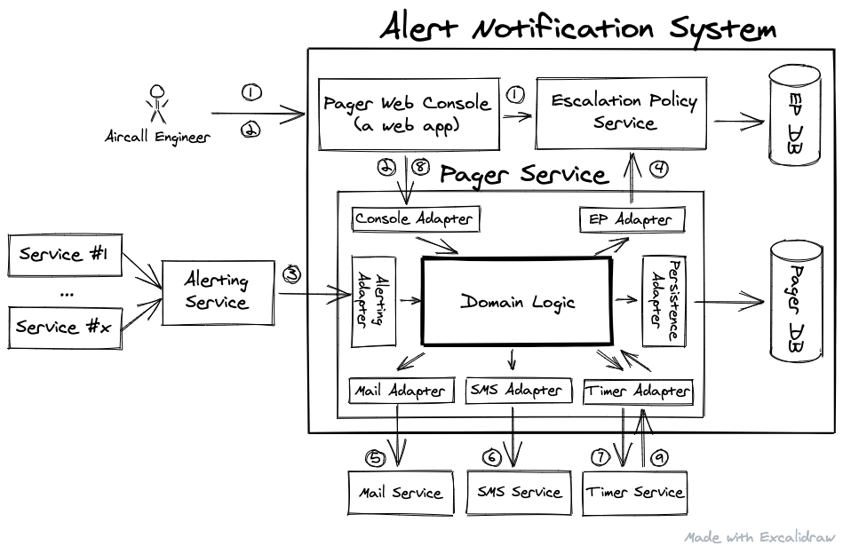

# Technical Test - Pager

The goal of this test is to evaluate:
- your modeling and testing skills of a small business case
- your ability to pair program with someone to add a new feature
- your ability to present your project to an audience

# Agenda

The following test has 3 parts:
1. at home, design and implement the domain logic of the pager service (~3h)
2. add a new feature during a pair programming session (1h)
3. present the result to two engineers (1h)

# Problem

Aircall uses the tool Opsgenie to manage our incident alerts and on-call shifts.

For the sake of this exercise (and not a manifestation of the Not Invented Here syndrome), let's imagine we want to implement an in-house alert notification system.

Here is the architecture of this system:



Through the web console, the Aircall engineer is able to read and edit the Escalation Policy (1). An Escalation Policy references a Monitored Service by its identifier. It contains an ordered list of levels. Each level contains a set of targets. Each target can be of two types: email or SMS. Email Target contains the email address and SMS Target contains the Phone Number. This console also allows the engineer, when the incident is closed, to inform the Pager Service that the Monitored Service is now Healthy (2).

The Monitored Service in case of dysfunction sends an Alert (composed of the Alert Message and the Identifier of the Service) to the Alerting Service (the alerts central place). Those alerts are forwarded to the Pager Service (3). Then this service based on the Escalation Policy of the Monitored Service (available from the EP Service (4)), sends the notifications to all the Targets of the first Policy Level, by mail (5) or SMS (6). After that the service set an external timer for the Acknowledgement Timeout (7). A target must acknowledge the alert within 15-minutes (8). In case the Pager receives a Service Healthy event (2), the Monitored Service is flagged Healthy and no more notifications will be sent until the next Alert. In case of Acknowledgement Timeout (9) with no prior Alert Acknowledgement (8) or Healthy event (2), the Pager Service escalates to the next Policy Level to notify the targets of the second level and set the timer. And so on...

## Use Case Scenarios

Here is the list of Use Case Scenarios that specify what the Pager Service needs to accomplish:

```
Given a Monitored Service in a Healthy State,
when the Pager receives an Alert related to this Monitored Service,
then the Monitored Service becomes Unhealthy,
the Pager notifies all targets of the first level of the escalation policy,
and sets a 15-minutes acknowledgement delay
```

```
Given a Monitored Service in an Unhealthy State,
the corresponding Alert is not Acknowledged
and the last level has not been notified,
when the Pager receives the Acknowledgement Timeout,
then the Pager notifies all targets of the next level of the escalation policy
and sets a 15-minutes acknowledgement delay.
```

```
Given a Monitored Service in an Unhealthy State
when the Pager receives the Acknowledgement
and later receives the Acknowledgement Timeout,
then the Pager doesn't notify any Target
and doesn't set an acknowledgement delay.
```

```
Given a Monitored Service in an Unhealthy State,
when the Pager receives an Alert related to this Monitored Service,
then the Pager doesn’t notify any Target
and doesn’t set an acknowledgement delay
```

```
Given a Monitored Service in an Unhealthy State,
when the Pager receives a Healthy event related to this Monitored Service
and later receives the Acknowledgement Timeout,
then the Monitored Service becomes Healthy,
the Pager doesn’t notify any Target
and doesn’t set an acknowledgement delay
```

**Please note** that many concurrency issues can happen in this system. For example, is the Pager Service allowed to send 2 notifications to the same target when 2 alerts (same or different one) are received at the same time ? Theis answer to this question is a product decision. For the sake of this exercise, let’s say the answer is “no” (only 1 notification is sent). So take care of this during your design phase. Even if database persistence is not part of the exercise, tell us in your README file what guarantees you expect from the database.

# Explanation

The goal of this document is to explain what the decisions were taken during the challenge.

## Versions and how to run the tests

The challenge was done using `nodejs@17.3.0`.

Jest framework was used in this repository to test the code. To run it, execute

```bash
    $ npm test
```

If you prefer watch mode, you can run

```bash
    $ npm run t-watch
```

## Took it for granted

The exercise speaks about Monitored Systems, but it doesn't specify if some services in the system
are NOT monitored. I took for granted that **all services** are monitored. That is the reason why
in the solution there is no a list with all monitored services. In case of having some monitored services
and other ones don't, a new structure `monitoredServices` could be added. In the use cases, we should use this
new structure to know if the message that we receive is related to a monitored service.

Also, the challenge doesn't say anything about what happens when an incident is notified (monitored service in
unhealthy state) and the escalation policy changes. For me, before an incident is created, the current escalation policy
is retrieved and assigned to the incident. If the escalation policy changes, the policy assigned to the incident doesn't
change.

Another point to take into consideration is that the Escalation Policy Adapter (EP Adapter in the diagram) will
transform the response given by the Escalation Policy service into a TargetsCollections object. So, if escalation policy
service changes how it models the policy for a service, pager service domain logic won't be affected by it.

Regarding timer adapter, it will be in charge of creating a timer with the id and minutes given by the client. This
adapter will be responsible for knowing when a timer finishes and call the proper use case to escalate the incident.

Last but not least, I had to decide what to do when a monitored service is marked as healthy or what to do when an
incident was acknowledged. Since the challenge statement says nothing about maintaining in DB a log for each incident
opened/closed in the system, I decided to remove an incident from db when it was acknowledged or the service marked
as healthy.

## Design

The model is very simple, there is only an aggregate in the system. The aggregate is called `Incident`. It relates
a service with the next targets to notify and also knows what is the timerId set.

There are 4 use cases right now in this system:

- CreateIncidentCommand: this command will be executed when an alert arrives at the system (3) to create an incident.
  It will be called from the Alerting Adapter. If there is already an opened incident, nothing will be performed.
- DeleteIncidentForServiceCommand: this command will be executed when an Aircall engineer marks the service as healthy.
  The console adapter or the alert adapter (if an alert that the service is healthy arrives) will call this command
  and the incident will be deleted.
- DeleteIncidentByIdCommand: this command will be executed when an Aircall engineer acknowledges an incident. The
  console adapter will call this command and the incident will be deleted.
- EscalateIncident: this command will be executed when the Acknowledgement Timeout is reached. The timer adapter will
  execute this command. So, the incident will be updated, a new timer will be set and next targets will be notified.

The exercise speaks about different states in which a Monitored Service is (healthy | unhealthy). As I said before,
I am not storing a list with the monitored services and in which state they are. In order to compute the service's
state, we can know it using the Incident entity. If a service has an opened incident, then it is in unhealthy state.
Otherwise, it is healthy.

Notice how the timer is created. The timerId, which is stored in the Incident entity, it's generated by the client.

Last but not least, NullPattern is used with TargetsCollections in the method `first`. This allows us to return in that
method the same interface instead of returning null or undefined.

### Database constraints

In order to avoid having more than one incident by service, a unique index is set on the `service_id` column in the
table/collection Incident. The primary key for this table is set on `id` column.

As we don't know anything about performance and not functional requirements to meet, it's open to decide what DB to
use.

### Improvements && tradeoffs

The chosen language to do the challenge was JavaScript. Why? Two main reasons: it is plug&play without any tooling and
also because the challenge was not too big. I could have added TypeScript, but, to be honest, I forgot it a bit after
more than a year and a half without working with it. I know that I can catch it up very fast but that was not the goal
of this challenge. So, the first improvement would be to add TypeScript to the challenge.

Nowadays, domain events are neither created nor published. It seems that no other service will use the domain events
raised in Pager service domain, so I discarded creating it. Some domain events would be `IncidentCreated`,
`IncidentEscaled` or `IncidentDeleted`.

Also, mocks in the tests should be improved. Some duplicated code was created. Due to time constraints, I decided to
leave it as it is.
